# VOKTER

Propuesta de evolución de la tienda [VOKTER](https://vokter-five.vercel.app/): una tienda web de tecnología, ropa deportiva y hogar, más una app de Android construida sobre el mismo código.

| | |
|---|---|
| **Web publicada** | https://dark-fax.github.io/vokter-nextgen/ |
| **Descargar la app (Android)** | Página de descarga: https://dark-fax.github.io/vokter-nextgen/#/app · APK directo: https://dark-fax.github.io/vokter-nextgen/vokter.apk |
| **Código fuente** | Rama `main` de este repositorio (la rama `gh-pages` solo contiene la versión compilada que se publica) |

<p>
  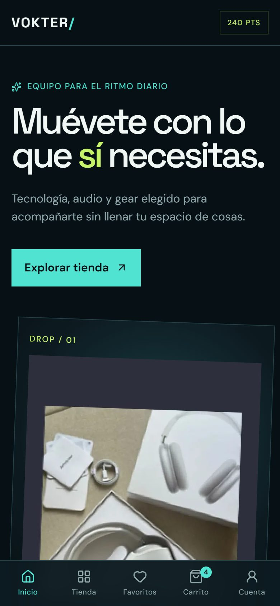
  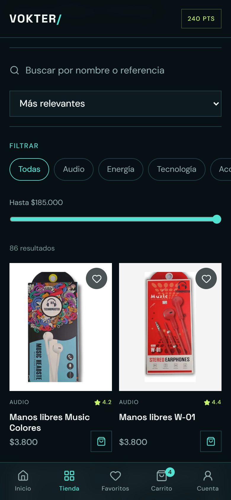
  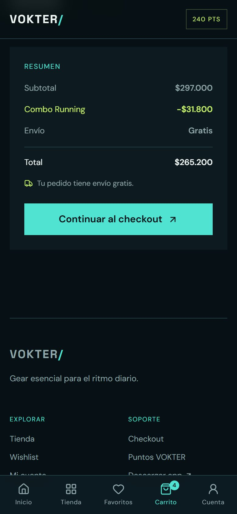
  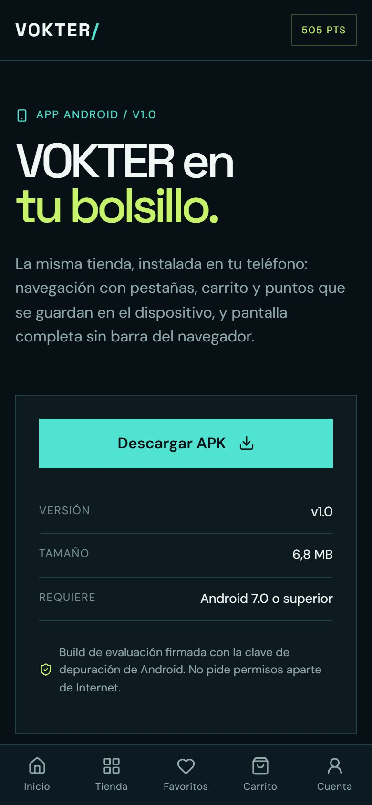
</p>

## Contenido

1. [Propuesta](#propuesta)
2. [Análisis de la plataforma de referencia](#análisis-de-la-plataforma-de-referencia)
3. [Funcionalidades](#funcionalidades)
4. [App móvil: descarga e instalación](#app-móvil-descarga-e-instalación)
5. [Evidencias visuales](#evidencias-visuales)
6. [Tecnologías](#tecnologías)
7. [Arquitectura y organización](#arquitectura-y-organización)
8. [Instalación y ejecución](#instalación-y-ejecución)
9. [Calidad: pruebas y auditoría](#calidad-pruebas-y-auditoría)
10. [Decisiones técnicas](#decisiones-técnicas)
11. [Datos del catálogo](#datos-del-catálogo)
12. [Seguridad](#seguridad)
13. [Limitaciones y siguientes pasos](#limitaciones-y-siguientes-pasos)

## Propuesta

Una sola base de código que funciona como **tienda web** y como **app de Android instalable**, con la misma experiencia en ambas. La propuesta toma la referencia (catálogo por categorías, destacados, carrito, favoritos y combos) y la lleva a una tienda que se puede recorrer de punta a punta: buscar, filtrar, armar combos, pagar (simulado), acumular y canjear puntos, y consultar el historial de pedidos, en el navegador o en el teléfono.

Los tres ejes de la propuesta:

- **Catálogo real:** 86 productos con foto, nombre, referencia y precio tomados del material gráfico de la tienda, no productos de ejemplo.
- **Experiencia móvil primero:** la interfaz se diseñó primero para el teléfono (barra de pestañas inferior, botones de tamaño táctil, respeto de las barras del sistema de Android) y después se amplía a tablet y escritorio.
- **Confiabilidad:** reglas de precios en un solo lugar, datos guardados validados, 34 pruebas automáticas y 45 pruebas de seguridad documentadas.

## Análisis de la plataforma de referencia

Revisión de https://vokter-five.vercel.app/ y qué se hizo con cada punto:

| En la referencia | En esta propuesta |
|---|---|
| Menú: Inicio, Tienda, Footwear, Tech & Gadgets, Gear & Essentials, Drops | Tienda con 6 categorías reales (Audio, Energía, Tecnología, Accesorios, Ropa deportiva, Hogar), búsqueda por nombre o referencia, filtro de precio, orden y paginación. En el teléfono, barra de pestañas fija (Inicio, Tienda, Favoritos, Carrito, Cuenta). |
| Productos destacados con calificación | Se mantiene, con fotos reales del catálogo. |
| Combos promocionales (Running 15%, Tech 20%, Home 10%) | Combos Running (15%), Escritorio (20%) y Descanso (10%) que se agregan con un botón y se descuentan solos en el carrito. Cada producto que forma parte de un combo lo sugiere en su ficha. |
| "Envío gratis desde $50.000" | Se aplica de verdad: por debajo de $50.000 el envío cuesta $8.000 y el carrito indica cuánto falta. |
| Carrito y favoritos | Se guardan en el dispositivo y se validan al leerse. Aviso de confirmación al agregar. |
| Cuenta de usuario (login) | Cuenta de demostración con perfil (datos del último envío), estadísticas e historial de pedidos. |
| Sin programa de puntos | **Nuevo:** 1 punto por cada $1.000, canjeables en el checkout (cada punto vale $100). |
| Sin app móvil | **Nuevo:** app de Android descargable desde la web (botón, QR y página con instrucciones). |
| Checkout no visible | **Nuevo:** checkout con validación de datos, resumen con combos, envío y puntos, y aviso de "procesando pago". |
| Categoría Footwear (calzado) | No incluida: el material gráfico trae precios y tallas de zapatillas en notas manuscritas, pero no fotos, y cada producto de esta propuesta debía tener imagen real. |

## Funcionalidades

**Tienda (web y app)**

- Inicio con destacados, categorías con foto y conteo de productos, combos y acceso a la descarga de la app.
- Catálogo de 86 productos: búsqueda por nombre o referencia, filtro por categoría (chips deslizables en el teléfono), filtro de precio máximo, orden por relevancia, precio o calificación, y carga de 12 en 12.
- Ficha de producto con foto, referencia, descripción por categoría, favorito y sugerencia de combo. Un enlace a un producto que no existe muestra un aviso en lugar de otro producto.
- Carrito con cantidades (1 a 99), descuento por combo automático, envío y aviso de cuánto falta para el envío gratis.
- Checkout con validación de nombre, correo, teléfono, ciudad y dirección; canje opcional de puntos; aviso de procesamiento de unos 2 segundos y bloqueo del formulario para evitar pedidos duplicados.
- Confirmación del pedido y cuenta con perfil, puntos, estadísticas e historial completo.
- Aviso "Agregado al carrito" con acceso directo al carrito.
- Página "no encontrada" para direcciones que no existen, y pantalla de recuperación si algo falla al dibujarse.

**Solo en la app de Android**

- Pantalla completa sin barra del navegador, con iconos del sistema legibles sobre el fondo oscuro.
- La página "App" reconoce que ya se está dentro de la app instalada y lo indica en lugar de ofrecer la descarga.
- Fuentes e imágenes incluidas en el APK: se ve completa aunque el teléfono no tenga conexión.

## App móvil: descarga e instalación

**Mecanismo de distribución:** el APK se publica junto con la web en GitHub Pages, así que la descarga sale del mismo sitio que se evalúa. Desde la web se llega por cuatro caminos: el enlace **App** del menú, el bloque **"Lleva VOKTER en tu teléfono"** de la página de inicio (con código QR), el enlace **"Descargar app"** del pie de página y la página https://dark-fax.github.io/vokter-nextgen/#/app.

**Para instalarla en Android (7.0 o superior):**

1. Desde el teléfono, abre la página de descarga y toca **Descargar APK**, o escanea el código QR con la cámara desde el computador.
2. Abre el archivo descargado. Android pedirá permitir **"Instalar apps desconocidas"** para el navegador: es el paso normal para apps que no vienen de Play Store.
3. Instala y abre **VOKTER**.

| Dato | Valor |
|---|---|
| Archivo | `vokter.apk` (6,8 MB) |
| Identificador | `com.vokter.app`, versión 1.0 |
| Tipo de build | Depuración (firmado con la clave de depuración de Android), adecuado para evaluación |
| Permisos | Solo Internet |

## Evidencias visuales

| Teléfono | | | |
|---|---|---|---|
|  | 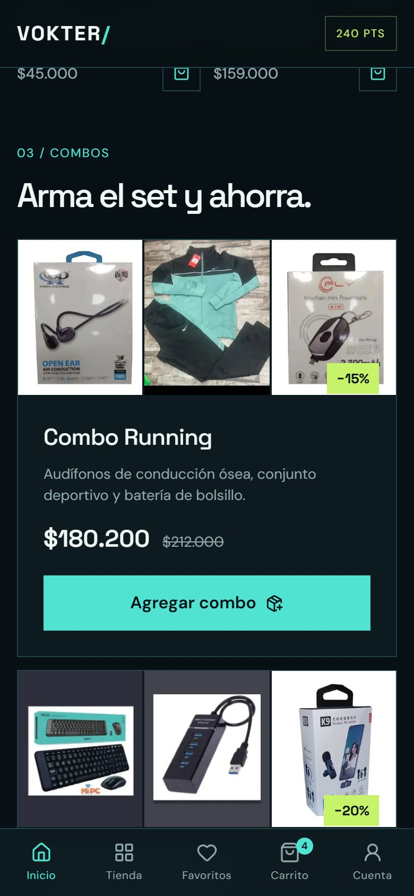 |  | 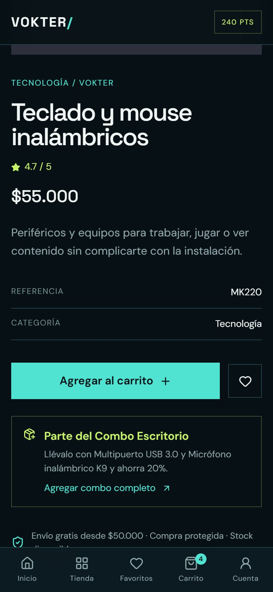 |
| Inicio | Combos | Catálogo con filtros | Ficha con combo sugerido |
|  | 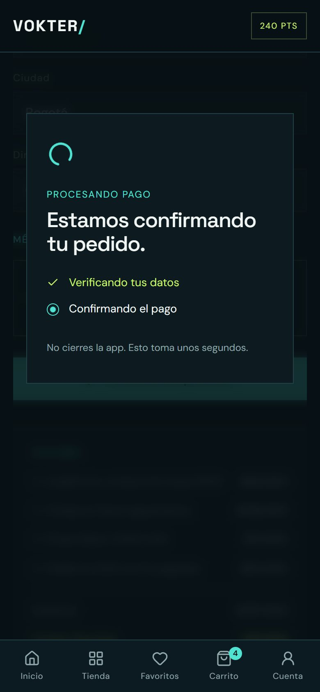 | 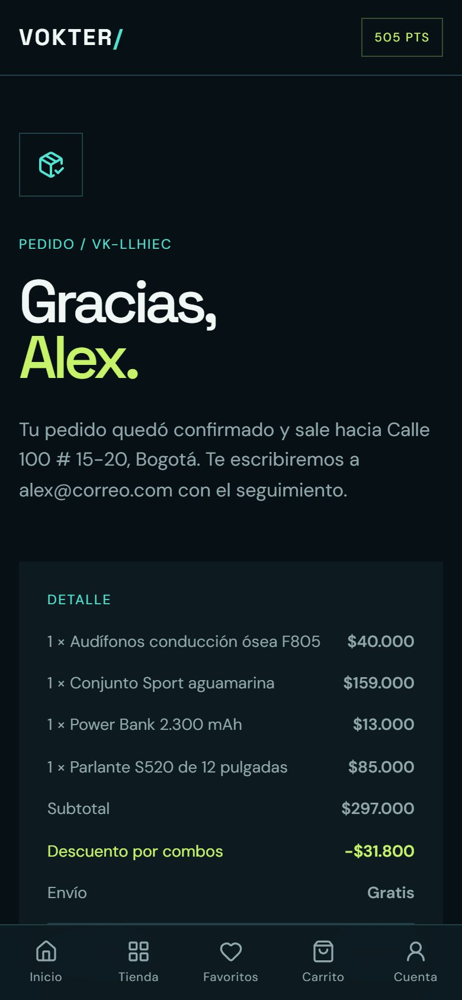 |  |
| Carrito con combo y envío | Procesando pago | Confirmación y puntos | Descarga de la app |

**Escritorio**

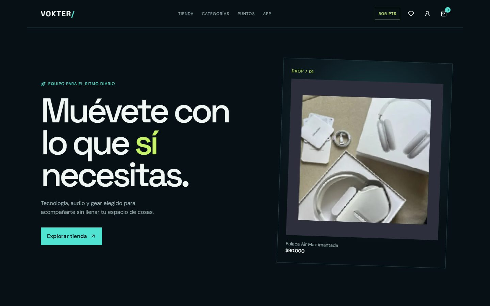
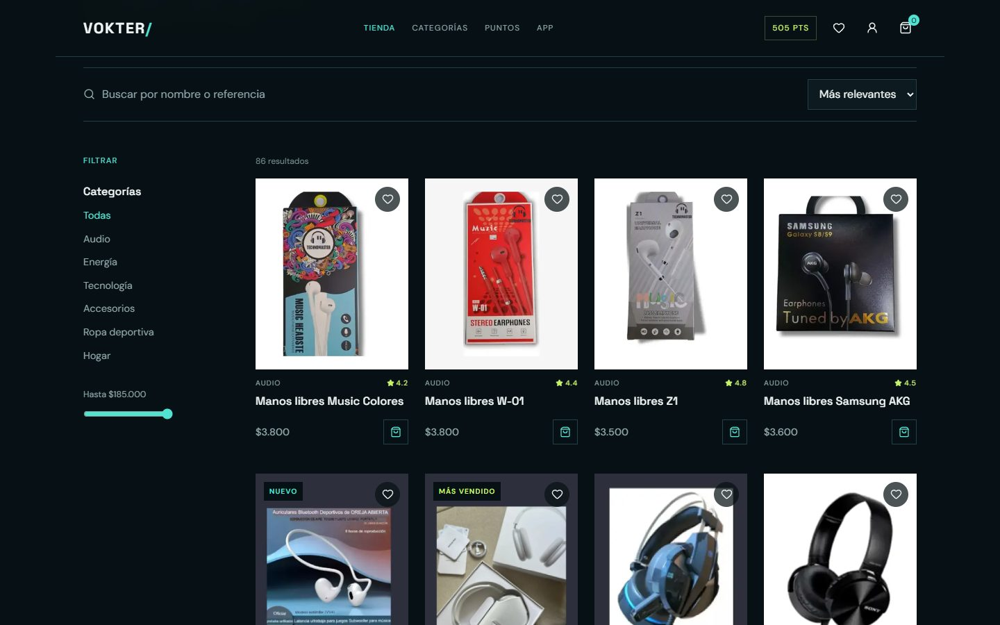
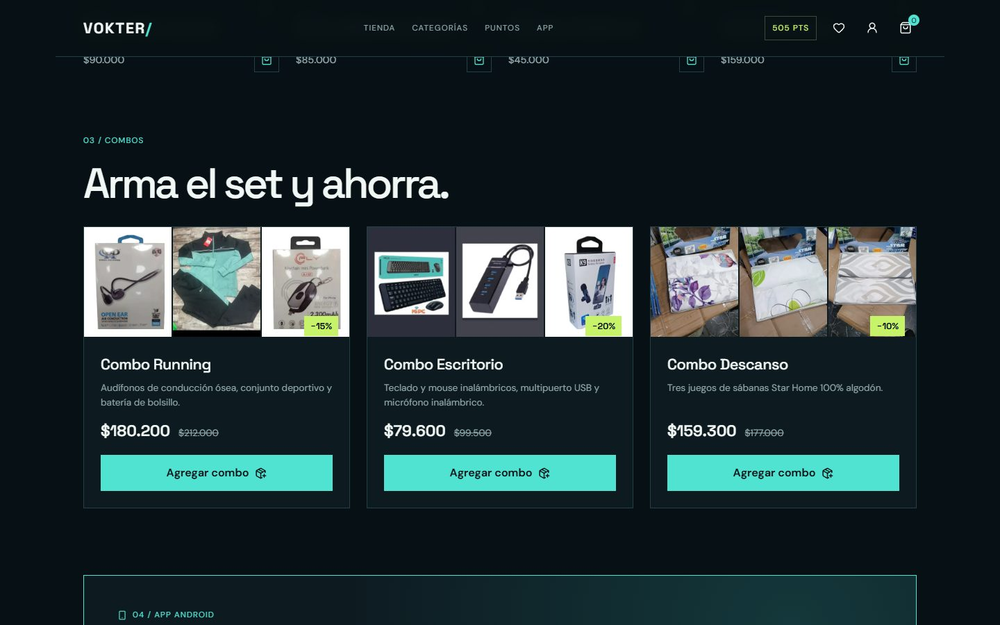
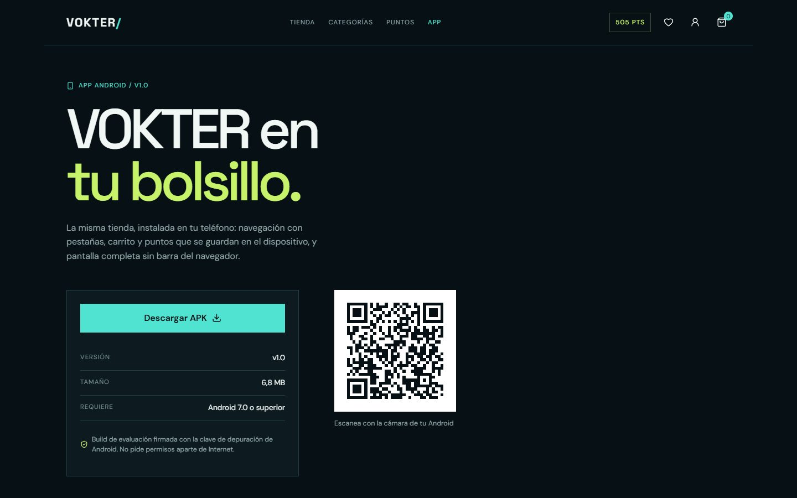
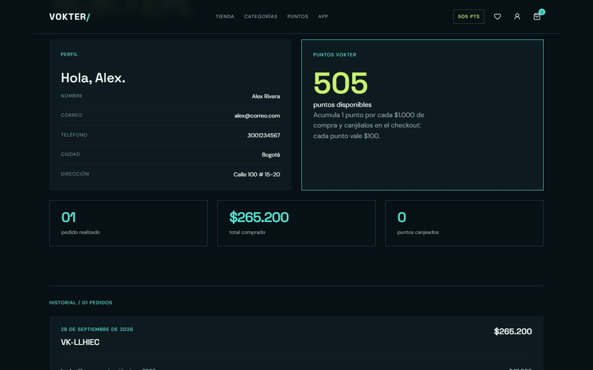

## Tecnologías

| Área | Herramienta | Para qué |
|---|---|---|
| Interfaz | React 19 + TypeScript | Componentes y tipado de datos (productos, pedidos, precios). |
| Compilación | Vite | Servidor de desarrollo y build de producción. |
| Estilos | Tailwind CSS 4 + CSS propio con variables | Reset y utilidades de Tailwind; el diseño se define con variables de color y espaciado propias (ver `src/index.css`). |
| Navegación | React Router (`HashRouter`) | Rutas que funcionan igual en la web publicada y dentro del APK. |
| App móvil | Capacitor 8 (Android) | Empaqueta la web en una app nativa de Android. |
| Íconos | lucide-react | Íconos de interfaz. |
| Fuentes | @fontsource (DM Sans, Space Grotesk) | Fuentes incluidas en la app, sin depender de Google Fonts. |
| Pruebas | Vitest | Pruebas automáticas de precios, puntos y validación de datos. |
| Calidad | oxlint, Lighthouse, Puppeteer | Revisión de código, auditoría de rendimiento y accesibilidad, y pruebas en navegador. |
| Publicación | GitHub Pages | Web y APK en el mismo sitio. |

## Arquitectura y organización

La tienda funciona sin servidor: el catálogo viene dentro de la app y el carrito, los favoritos y la cuenta se guardan en el dispositivo (`localStorage`). La misma carpeta `dist/` se publica en la web y se copia dentro del APK.

```
src/
  data/          catálogo (products.ts), datos de la app (app.ts)
  utils/         reglas de negocio sin interfaz: precios y combos (pricing.ts),
                 puntos, validación de datos guardados (storedData.ts), sanitización
                 + sus pruebas (*.test.ts)
  context/       estado compartido: carrito, favoritos, cuenta
  hooks/         acceso a ese estado desde los componentes
  components/    piezas reutilizables: tarjeta de producto, combo, resumen de compra,
                 aviso del carrito, menú, pie de página, pantalla de recuperación
  pages/         una pantalla por ruta: inicio, tienda, producto, carrito, checkout,
                 confirmación, cuenta, favoritos, descarga
public/          imágenes de productos (640 px y miniaturas de 320 px), QR, ícono
android/         proyecto nativo de Android generado por Capacitor
docs/            capturas del README
material-grafico/ material original entregado (capturas de catálogo, fotos, notas)
```

**Flujo de un pedido:** la pantalla solo indica *qué* se compra (productos y puntos pedidos). `utils/pricing.ts` calcula subtotal, combos, envío, puntos y total con los precios del catálogo; `AccountContext` guarda el pedido con esos montos; al volver a abrir la app, `utils/storedData.ts` recalcula cada pedido guardado y descarta los que no coincidan.

## Instalación y ejecución

**Requisitos:** Node.js 20.19 o superior (o 22.12+). Para compilar el APK además: Android SDK y **Java 21** (Capacitor 8 no compila con Java 17; sirve el JDK que incluye Android Studio en `jbr/`).

```bash
npm install
npm run dev        # tienda en http://localhost:5173
npm test           # 34 pruebas automáticas
npm run lint       # revisión de código
npm run build      # versión de producción en dist/
npm run preview    # sirve dist/ para revisarla
```

**Generar el APK:**

```bash
npm run build
npx cap sync android
cd android
./gradlew assembleDebug    # en Windows: gradlew.bat assembleDebug
# resultado: android/app/build/outputs/apk/debug/app-debug.apk
```

Si Gradle no encuentra el SDK, crea `android/local.properties` con `sdk.dir=RUTA/AL/Android/Sdk` (este archivo no se versiona porque depende de cada máquina).

**Publicar la web y el APK:** se compila, se copia `dist/` a una carpeta aparte junto con el APK renombrado a `vokter.apk` y un archivo vacío `.nojekyll`, y ese contenido se sube como rama `gh-pages`. GitHub Pages sirve esa rama en https://dark-fax.github.io/vokter-nextgen/.

## Calidad: pruebas y auditoría

**Pruebas automáticas** (`npm test`, 34 pruebas en `src/utils/*.test.ts`): combos (solo completos, sin descuento doble, redondeo), envío (umbral de $50.000, después de combos), puntos (tope por saldo, no descuentan el envío, total nunca negativo) y validación de datos guardados (cantidades, productos inexistentes, precios falsificados, pedidos alterados, saldo escrito a mano, pedidos de versiones anteriores).

**Lighthouse** (modo móvil, versión compilada):

| Página | Rendimiento | Accesibilidad | Buenas prácticas | SEO |
|---|---|---|---|---|
| Inicio | 89 | 100 | 100 | 100 |
| Tienda | 93 | 100 | 100 | 100 |
| Producto | 97 | 100 | 100 | 100 |
| Descarga de la app | 96 | 100 | 100 | 100 |
| Carrito | 98 | 100 | 100 | 100 |
| Cuenta | 98 | 100 | 100 | 100 |

La primera auditoría dio 80 de rendimiento y 93 de accesibilidad en la página de inicio. Se corrigió con: fuentes incluidas en la app en lugar de Google Fonts (−1,6 s de bloqueo), miniaturas de 320 px para las tarjetas, más contraste en los textos grises, región principal (`<main>`), orden de títulos, ícono propio, descripción de la página y `robots.txt`.

**Pruebas en navegador** con Puppeteer en anchos de 360, 390, 820 y 1440 px: sin desplazamiento horizontal, sin imágenes rotas ni errores de consola, y flujo completo de compra (agregar, combo, checkout, confirmación, historial). La versión publicada en GitHub Pages se verificó con la misma prueba.

## Decisiones técnicas

- **Capacitor en lugar de una app nativa separada:** una sola base de código para web y móvil asegura la misma experiencia y el mismo catálogo en ambas, que es lo que pide la integración web-móvil. La app aprovecha lo nativo donde importa: pantalla completa, barras del sistema y funcionamiento sin conexión.
- **`HashRouter` y rutas relativas (`base: './'`):** el APK sirve los archivos desde su propia carpeta y GitHub Pages desde `/vokter-nextgen/`; con rutas relativas y navegación por `#` el mismo build funciona en los dos lugares sin configuración de servidor.
- **Sin servidor, con datos validados:** para una demo evaluable sin cuentas ni costos de infraestructura, el estado vive en el dispositivo. Como cualquiera puede editarlo, todo lo que se lee se valida y se recalcula (ver [Seguridad](#seguridad)).
- **Una sola función de precios:** carrito, checkout, confirmación y validación usan `orderTotals()`, así las cifras que ve el cliente, las que se guardan y las que se validan no pueden diferir.
- **Puntos calculados desde el historial:** el saldo no se guarda como un número editable; se reconstruye pedido por pedido.
- **Imágenes procesadas a partir del material entregado:** las fotos se recortaron de las capturas del catálogo y se guardaron en WebP en formato 4:5, en dos tamaños (640 y 320 px). Pesan 2,7 MB en total para 86 productos.
- **Diseño con variables y breakpoints fijos** (480, 768, 1024 y 1280 px): espaciado en escala de 4 px y márgenes que crecen por tamaño de pantalla, para que la grilla sea consistente en todas las vistas.
- **Pantalla completa en todas las versiones de Android:** Android 15+ la impone; activarla también en versiones anteriores hace que el margen inferior se calcule una sola vez y evita una franja vacía bajo el menú.

## Datos del catálogo

- Fuente: carpeta `material-grafico/`. Electrónica, cables, energía y accesorios (63 productos) usan el nombre, la referencia y el precio de las fichas del catálogo GD Gold.
- **Ropa deportiva (12) y hogar (11): el material no trae precios**, así que los precios son estimados y están marcados así en `src/data/products.ts`.
- Las calificaciones de los productos son de demostración.
- No se usó la foto de la fachada (`05-fachada-tienda`) porque muestra un aviso de arriendo con números de teléfono personales.

## Seguridad

VOKTER no tiene servidor: el catálogo viene dentro de la app y el carrito, los favoritos, los puntos y los pedidos se guardan en el propio dispositivo (en el `localStorage` del navegador o del WebView del APK). Por eso las pruebas se centraron en tres preguntas: ¿se puede ejecutar código metiendo HTML en los formularios?, ¿se puede hacer trampa editando lo que la app guarda?, y ¿qué pasa si se escribe una dirección a mano?

### Cómo se hicieron las pruebas

- Se automatizaron con un navegador Chrome controlado por script (Puppeteer), emulando un teléfono de 390 px de ancho, contra el mismo código compilado que se empaqueta en el APK (`dist/`).
- Cada ataque se ejecutó dos veces: antes de corregir (para registrar el fallo) y después (para confirmar la corrección). En total fueron 45 ataques, más 2 pruebas de control que confirman que una compra normal (con canje de puntos) y el límite de 99 unidades siguen funcionando después de las correcciones.
- En cada caso se comprobó: si el código inyectado llegó a ejecutarse (el script intenta escribir `window.__pwned`), si aparecieron elementos HTML inyectados en la página, si la pantalla quedó en blanco y si hubo errores en la consola.
- **APK:** las pruebas no se ejecutaron en un teléfono ni en un emulador. El APK carga exactamente el mismo código web, así que los resultados aplican igual; la diferencia está en *cómo* llega un atacante a los datos guardados (ver "Particularidades del APK").

### 1. Inyección de HTML/JavaScript en campos de texto

Cargas probadas en cada campo: ``, `"><svg onload="...">`, `<script>...</script>` y `javascript:...`.

| Dónde | Resultado | ¿Se corrigió algo? |
|---|---|---|
| Buscador del catálogo | No se ejecutó nada. Los caracteres `<` y `>` se eliminan al escribir y aparece el aviso "Se eliminaron los caracteres < y >". El texto `javascript:...` queda como búsqueda sin resultados. | No hacía falta. |
| Checkout: nombre, ciudad y dirección | No se ejecutó nada. El pedido se crea con el texto sin `<` ni `>` (por ejemplo `Alex img src=x onerror=...`) y se muestra como texto plano en la confirmación y en "Cuenta". | No hacía falta. |
| Checkout: correo y teléfono | El formulario rechaza el envío: "Escribe un correo válido." y "Usa entre 7 y 12 dígitos." | No hacía falta. |
| HTML escrito directamente en un pedido guardado (saltándose el formulario) | No se ejecutó nada: React muestra todo como texto, nunca como HTML. | Sí, indirectamente: ahora ese pedido se descarta por no cuadrar con el catálogo (ver punto 2). |
| HTML en la dirección: `/tienda?category=`, `/pedido/confirmado?pedido=<script>...`, `/producto/` | No se ejecutó nada. Los parámetros solo se usan para buscar coincidencias, nunca se insertan como HTML. | Sí para `/producto/...`: antes mostraba otro producto (ver punto 3). |

Revisión del código: no se usa `dangerouslySetInnerHTML`, `innerHTML`, `eval`, `new Function` ni `document.write`, y ningún enlace (`href`) se construye con datos escritos por el usuario.

### 2. Manipulación de los datos guardados (`localStorage`)

Claves que usa la app: `vokter-cart` (carrito), `vokter-wishlist` (favoritos) y `vokter-account` (puntos e historial de pedidos). Se editaron desde la consola del navegador, por ejemplo:

```js
localStorage.setItem('vokter-account', JSON.stringify({ points: 99999999, orders: [] }))
localStorage.setItem('vokter-cart', '[{"product":{"id":"parlante-s520"},"quantity":1e999}]')
```

| Ataque | Antes de corregir | Después |
|---|---|---|
| Saldo de puntos cambiado a 99.999.999 | **Fallo.** La app mostraba "99999999 pts" y dejaba canjearlos: un parlante de $85.000 quedaba en **$0**. | El saldo ya no se lee de ese número: se recalcula desde el historial y vuelve a 240 pts. El mismo carrito cuesta $61.000 (canjeando los 240 pts reales). |
| Saldo `1e308` | **Fallo.** Se mostraba "1e+308 pts". | 240 pts. |
| Saldo negativo, como texto (`"999"`) o decimal (`12.7`) | Negativo y texto volvían a 240; el decimal se redondeaba a 12. | 240 pts en todos los casos. |
| Producto inexistente en el carrito (`id: "no-existe"`) | Se descartaba. | Igual. |
| Precio falsificado (`price: "$1"` para el parlante de $85.000) | Se ignoraba: se usa el precio del catálogo. | Igual. |
| Cantidad 0,5 | **Fallo.** Se aceptaba media unidad: total $42.500. | Se descarta la línea. |
| Cantidad 1.000.000.000 | **Fallo.** Total de $85.000.000.000.000. | Se limita a 99 unidades ($8.415.000). |
| Cantidad infinita (`1e999` en el JSON) | **Fallo.** El carrito mostraba "Infinity" unidades y total "$∞". | Se descarta la línea. |
| Cantidad negativa o como texto (`"5"`) | Se descartaba. | Igual. |
| JSON roto o que no es una lista | Carrito vacío, sin errores. | Igual. |
| Pedido con total negativo (cantidad `-1`, precio `-$999.999` y 99.999.999 puntos) | El total nunca bajó de $0, pero el pedido salía **gratis** gracias a los puntos falsos. | Sin puntos falsos, el descuento se limita a los puntos reales. Un total negativo sigue siendo imposible; desde que existe el envío pagado, los puntos solo descuentan productos, así que el mínimo es el costo del envío ($8.000 en este caso). |
| Pedido falso en el historial con total `-500000` y `pointsEarned: 999999` | **Fallo grave.** La app entera quedaba **en blanco** (sin menú ni forma de salir) en "Cuenta" y en la confirmación. Error: `Cannot read properties of undefined (reading 'replace')`. | El pedido se descarta porque sus cifras no cuadran con el catálogo. La cuenta se muestra normal y la confirmación dice "No encontramos ese pedido". |
| Pedido sin cliente ni productos | **Fallo.** Pantalla en blanco al abrir su confirmación. | Se descarta. |
| Pedido con un producto sin precio | **Fallo.** Pantalla en blanco en "Cuenta" y en la confirmación. | Se descarta. |
| Pedido con `total: "gratis"` | Se mostraba y descuadraba las estadísticas de la cuenta. | Se descarta. |
| 5.000 favoritos falsos y duplicados | Se conservaban los 5.002 valores guardados. | Solo queda 1 favorito (el único producto real, sin duplicar). |

**Qué se corrigió** (en [src/utils/storedData.ts](src/utils/storedData.ts)):

- **Puntos:** ya no se guarda ni se lee un saldo. Se calcula recorriendo el historial desde el pedido más antiguo: 240 iniciales, menos los puntos usados, más los ganados en cada pedido. Si un pedido usa más puntos de los que había en ese momento, se descarta.
- **Pedidos:** solo se acepta un pedido guardado si todo cuadra con el catálogo: el subtotal es la suma de sus productos a precio real, el descuento son los puntos usados × $100, el total es el subtotal menos el descuento, y los puntos ganados son 1 por cada $1.000. Además debe tener un código válido (`VK-...`), fecha, datos del cliente y productos que existan.
- **Carrito:** cada línea se reconstruye con el producto del catálogo (nunca con el precio o la imagen guardados), y solo se aceptan cantidades enteras de 1 a 99. En la pantalla del carrito, el botón "+" se desactiva al llegar a 99.
- **Favoritos:** solo se guardan ids de productos existentes, sin duplicados.
- **Red de seguridad:** si alguna pantalla fallara al dibujarse, en lugar de quedar en blanco se muestra "No pudimos mostrar esta pantalla" con un botón **Restablecer datos**. Esto importa sobre todo en el APK, donde no hay barra de direcciones para recargar. ([src/components/layout/ErrorBoundary.tsx](src/components/layout/ErrorBoundary.tsx))

**Límite que no se puede cerrar sin servidor:** alguien con acceso a la consola todavía podría inventar pedidos *con cifras correctas* (productos reales, precios exactos) para sumar puntos. Hacerlo exige fabricar compras completas y coherentes en lugar de cambiar un número, pero la única protección real sería validar pedidos y puntos en un servidor. En esta demo nada de eso tiene efecto fuera del propio dispositivo: no hay pagos reales ni otra persona afectada.

### 3. Rutas y parámetros manipulados en la URL

La app no tiene rutas protegidas (no hay inicio de sesión), así que se probó qué pasa al escribir direcciones a mano.

| Dirección | Antes | Después |
|---|---|---|
| `/producto/no-existe` y `/producto/%00` | **Fallo.** Mostraba el primer producto del catálogo ("Manos libres Music Colores") como si fuera el producto buscado. | "Este producto no existe." con un enlace al catálogo. |
| `/producto/` (sin id), `/admin`, `/cuenta/../../etc/passwd` | **Fallo.** Pantalla vacía entre el menú y el pie de página, sin ningún mensaje. | Página "Esta página no existe." con un enlace al inicio. |
| `/pedido/confirmado?pedido=VK-NOEXISTE` | "No encontramos ese pedido." | Igual. |
| `/pedido/confirmado` sin parámetro | Muestra el último pedido guardado **en ese mismo dispositivo** o "No encontramos ese pedido". No expone datos de otras personas porque no hay datos fuera del dispositivo. | Igual, pero ya solo con pedidos válidos. |
| `/tienda?category=Inexistente` y una categoría de 5.000 caracteres | "0 resultados" con opción de limpiar filtros, sin errores. | Igual. |
| `/checkout` con el carrito vacío | "No hay nada que pagar." | Igual. |

### 4. Claves, tokens y credenciales en el código

- Se buscaron patrones de claves (`api_key`, `secret`, `token`, `password`, `bearer`, claves de Google `AIza...`, OpenAI `sk-...`, GitHub `ghp_...`, bloques `-----BEGIN ... KEY-----`) en todos los archivos versionados, en todo el historial de git (`git log --all -p`), en el código compilado `dist/` y en los archivos que van dentro del APK.
- **Resultado: no hay ninguna credencial.** Las únicas coincidencias fueron falsos positivos: el texto `sk-t` dentro del dibujo de dos iconos SVG (`public/favicon.svg`, `src/assets/vite.svg`), y la palabra `password` en una lista interna de React con tipos de campos de formulario.
- Tampoco hay archivos sensibles versionados (`.env`, `keystore`/`.jks`, `google-services.json`, `.pem`). El archivo `android/local.properties`, que contiene una ruta de la máquina de desarrollo, está en el `.gitignore`.
- La app no llama a ninguna API ni servicio externo: el catálogo, las imágenes y las fuentes tipográficas vienen dentro de la web y del APK.

### Particularidades del APK

- **Copias de seguridad:** el manifiesto de Android tenía `android:allowBackup="true"`, así que el nombre, correo, teléfono y dirección guardados en los pedidos podían terminar en las copias de seguridad del teléfono. Se cambió a `false`.
- **APK de depuración:** en un APK *debug* se puede inspeccionar la app desde `chrome://inspect` con el teléfono conectado por USB y editar `localStorage`, igual que en el navegador. Es la forma de reproducir en el teléfono las pruebas del punto 2, y las protecciones descritas funcionan igual ahí. Un APK de *release* no permite esta inspección.
- **Permisos:** la app solo declara `INTERNET`, el permiso por defecto de Capacitor. Hoy no lo necesita para funcionar.

## Limitaciones y siguientes pasos

- **Sin servidor:** los pedidos, puntos y favoritos viven en cada dispositivo y no se sincronizan entre la web y la app. El siguiente paso natural es una API con cuentas de usuario, que además cerraría el límite de seguridad descrito arriba (pedidos inventados con cifras correctas).
- **Pago simulado:** el checkout no cobra; integrar una pasarela de pagos requiere servidor.
- **APK de depuración:** adecuado para evaluar. Para distribuirlo al público haría falta un build de *release* firmado con una clave propia (guardada fuera del repositorio) o publicarlo en Play Store.
- **Calzado:** se puede agregar en cuanto haya fotos; los precios y tallas ya están en las notas del material gráfico.
- **Pruebas en dispositivo:** las pruebas automáticas se hicieron en navegador. En un teléfono real se verificaron la persistencia de datos y las imágenes; la corrección de la franja bajo el menú inferior está pendiente de confirmar en ese mismo teléfono.
